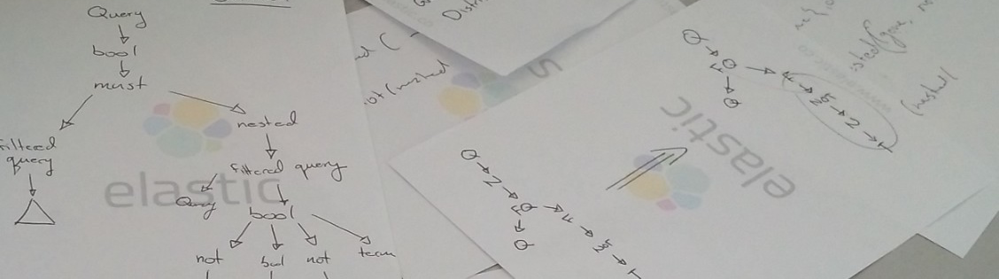

	Hi! I love all things tech. I've worked as a Dev, Architect, and Manager. I've even crawled around a data centre plugging in cables. I like to be where there are problems to fix and things to make. 

    

---

    

<!--
**andricDu/andricDU** is a ✨ _special_ ✨ repository because its `README.md` (this file) appears on your GitHub profile.

Here are some ideas to get you started:

- 🔭 I’m currently working on ...
- 🌱 I’m currently learning ...
- 👯 I’m looking to collaborate on ...
- 🤔 I’m looking for help with ...
- 💬 Ask me about ...
- 📫 How to reach me: ...
- 😄 Pronouns: ...
- ⚡ Fun fact: ...t
-->
